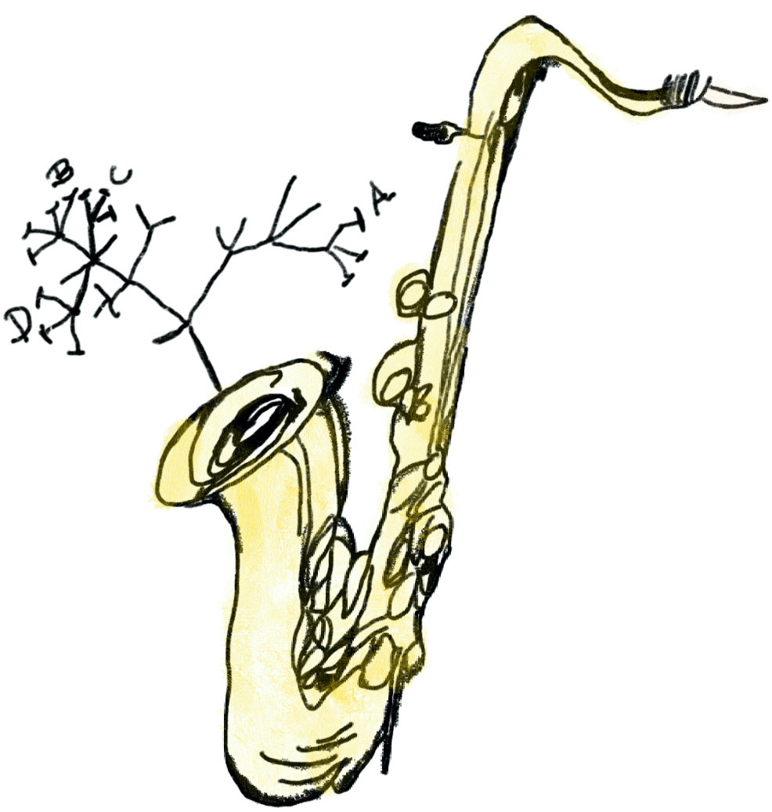

# Evolutionary Strategies :heart: JAX
[](https://pypi.python.org/pypi/mle-toolbox)[](https://github.com/RobertTLange/mle-toolbox/) [](https://badge.fury.io/py/mle-toolbox)
<a href="docs/evosax_transparent.png"></a>

Are you tired of having to handle asynchronous processes for neuroevolution? Do you want to leverage massive vectorization and high-throughput accelerators for evolutionary strategies (ES)? `evosax` allows you to leverage JAX and XLA compilation to scale ES to your favorite accelerator. The API follows the classical `ask`, `evaluate`, `tell` cycle and only requires you `vmap` and `pmap` over the fitness function axes of choice. It includes popular strategies such as Simple Gaussian, CMA-ES, and different NES variants.

## Basic API Usage

```python
from evosax.strategies.cma_es import init_strategy, ask, tell

# Initialize the CMA evolutionary strategy
rng = jax.random.PRNGKey(0)
params, memory = init_strategy(mean_init, sigma_init,
                               pop_size, mu)

# Loop over number of generations using ask-eval-tell API
for g in range(num_generations):
    # Explicitly handle random number generation
    rng, rng_input = jax.random.split(rng)

    # Ask for the next generation population to test
    x, memory = ask(rng_input, params, memory)

    # Evaluate the fitness of the generation members
    fitness = evaluate_fitness(x)

    # Tell/Update the CMA-ES with newest data points
    memory = tell(x, fitness, params, memory)
```

<details><summary>
Implemented evolutionary strategies.

</summary>

| Strategy | Reference | Implemented | Source Code | Example |
| --- | --- | --- | --- | --- |
| Simple Gaussian | :question: | :heavy_check_mark:  | [Click](evosax/strategies/gaussian.py) | [Low Dim. optimisation](notebooks/optimisation_gaussian.ipynb)
| CMA-ES | [Hansen (2016)](https://arxiv.org/abs/1604.00772) | :heavy_check_mark:  | [Click](evosax/strategies/cma_es.py) | [Pendulum RL task](notebooks/pendulum_cma_es.ipynb)
| OpenAI-ES | [Salimans et al. (2017)](https://arxiv.org/pdf/1703.03864.pdf) | :heavy_check_mark:  | [Click](evosax/strategies/open_nes.py) | [Simple Quadratic](notebooks/quadratic_open_nes.ipynb)
| IPOP/BIPOP/SEP | - | :station:  | - | -
| NES | [Wierstra et al. (2014)](https://www.jmlr.org/papers/volume15/wierstra14a/wierstra14a.pdf) | :station:  | - | -
| PEPG | [Sehnke et al. (2009)](https://citeseerx.ist.psu.edu/viewdoc/download;jsessionid=A64D1AE8313A364B814998E9E245B40A?doi=10.1.1.180.7104&rep=rep1&type=pdf) | :station:  | - | -
</details>


## Installing `evosax` and dependencies

`evosax` can directly be installed from PyPi.

```
pip install evosax
```

Alternatively, you can clone this repository and afterwards 'manually' install the toolbox (preferably in a clean Python 3.6 environment):

```
git clone https://github.com/RobertTLange/evosax.git
cd evosax
pip install -e .
```

This will install all required dependencies. Note that by default the `evosax` installation will install CPU-only `jaxlib`. In order to install the CUDA-supported version, simply upgrade to the right `jaxlib`. E.g. for a CUDA 10.1 driver:

```
pip install --upgrade jaxlib==0.1.57+cuda101 -f https://storage.googleapis.com/jax-releases/jax_releases.html
```

You can find more details in the [JAX documentation](https://github.com/google/jax#installation). Finally, please note that `evosax` is only tested for Python 3.6. You can directly run the test from the repo directory via `pytest`.

## Speed Benchmarks


Run and compile times are estimated on 1000 ask-eval-tell iterations for FFW-MLP (48 hidden units) policies on a `Pendulum-v0`-RL task and 50 fitness evaluation episodes. We make use of the [`gymnax`](https://github.com/RobertTLange/gymnax) package for accelerated RL environments and `jit` through entire RL episode rollouts. Stochastic fitness evaluations are collected synchronously and using a composition of `jit`, `vmap`/`pmap` (over evaluations and population members) and `lax.scan` (over sequential fitness evaluations).

<details> <summary>
  More device and benchmark details.

</summary>

| Name | Framework | Description | Device | Steps in Ep. | Number of Ep. |
| --- | --- | --- | --- | --- | --- |
CPU-STEP-GYM | OpenAI gym/NumPy | Single transition |2,7 GHz Intel Core i7| 1 | - |
</details>

<details> <summary>
  Notes on TPU acceleration considerations.

</summary>

- Implementing ES on TPUs requires significantly more tuning then originally expected. This may be partially due to the 128 x 128 layout of the systolic array matrix unit (MXU). Furthermore, efficient `pmap` is still work-in-progress.
</details>


## Intro, Examples, Notebooks & Colabs
* :book: [Blog post](https://roberttlange.github.io/posts/2020/12/neuroevolution-in-jax/): Walk through of CMA-ES and how to leverage JAX's primitives
* :notebook: [Low-dim. Optimisation](notebooks/optimisation_gaussian.ipynb): Simple Gaussian strategy on Rosenbrock function
* :notebook: [MLP-Pendulum-Control](notebooks/pendulum_cma_es.ipynb): CMA-ES on the `Pendulum-v0` gym task.


## Contributing & Development

Feel free to ping me ([@RobertTLange](https://twitter.com/RobertTLange)), open an issue or start contributing yourself.

## TODOs, Notes & Questions
- [ ] Make all neuroevo parts wrap around Haiku
- [ ] Restructure sampling out of strategies
- [ ] Jit with frozen dicts? -> also in Haiku!
    - https://github.com/google/flax/issues/587
    - https://github.com/google/flax/blob/master/flax/core/frozen_dict.py
    - Could make sense if we want to generate entire batches of CMA-ES runs and Jit through entire pipelines
- [ ] Add TPU example/How to do pmap over devices/hosts
- [ ] Clean up visualizations/animations + proper general API
- [ ] Implement more strategies
    - [ ] Add restarts for CMA-ES
    - [ ] Add NES strategy
    - [ ] Add PEPG strategy
- [ ] Implement more examples
    - [ ] MNIST classification example - CNNs
    - [ ] Small RNN example
    - [ ] Use flax/haiku as NN library for example
- [ ] More param -> network reshaping helpers
- [ ] Add a license
- [ ] [Connect notebooks with example Colab](https://colab.research.google.com/github/googlecolab/colabtools/blob/master/notebooks/colab-github-demo.ipynb#scrollTo=K-NVg7RjyeTk)
